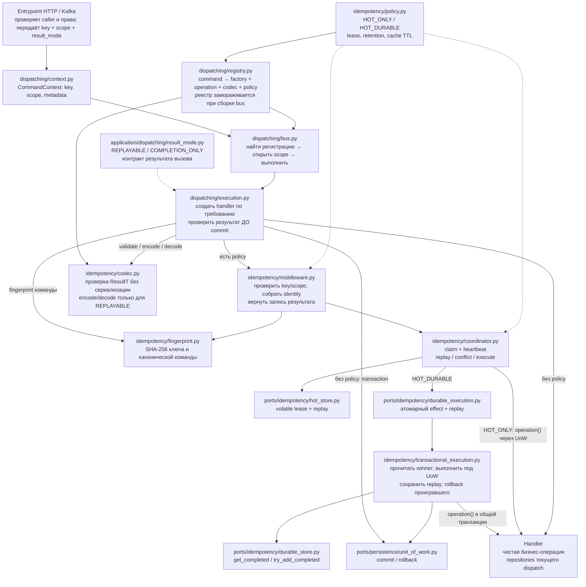
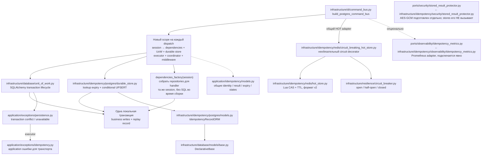

# Идемпотентность: карта файлов и связей

Карта актуализирована после рефакторинга читаемости 2026-09-07. Пути в схемах начинаются от
`src/app/`, если не написано иначе. Стрелки показывают вызовы/зависимости;
пунктир — передаваемые настройки. Файлы с одинаковыми именами различаются путём.

## 1. Как выполняется команда

**Где включается идемпотентность:** `dispatching/registry.py:register`,
параметр `idempotency_policy`. Класс команды сам режим не выбирает.
Без policy CommandExecution запускает обычную транзакцию. При policy он обращается
только к middleware; bus не разбирает внутренние состояния подсистемы.

**Что получает caller:** REPLAYABLE — типизированный результат; COMPLETION_ONLY —
None после успешного выполнения. При marker вместо запрошенного snapshot —
IdempotencyResultNotStoredError, без повторного handler.
На replay handler может не создаваться. В durable-гонке возвращается результат
победившей транзакции, а изменения проигравшей попытки откатываются.

## 2. Как собираются реальные адаптеры

SQL session не разделяется между параллельными dispatch. Связь business writes
и replay обеспечивает общий UoW. Redis находится вне SQL-транзакции и может
восстанавливаться из durable. Конкретные profile handlers/repositories и endpoints
ещё не подключены; блок Handler в первой схеме обозначает контракт расширения.

## 3. Что делает каждый файл

| Файл относительно src/app | Ответственность | Связи |
| --- | --- | --- |
| [application/dispatching/result_mode.py](../src/app/application/dispatching/result_mode.py) | REPLAYABLE / COMPLETION_ONLY: режим результата dispatch. | Caller → bus → execution; не входит в identity/fingerprint. |
| [application/commands/base.py](../src/app/application/commands/base.py) | BaseCommand[ResultT]: данные команды и статический тип ответа. | Используется bus/registry; runtime-схему не извлекает. |
| [application/dispatching/context.py](../src/app/application/dispatching/context.py) | Ключ, доверенный scope, actor и correlation metadata. | Entrypoint → bus → execution; обёртка получает только key/scope. |
| [application/dispatching/registry.py](../src/app/application/dispatching/registry.py) | Связывает command, фабрику handler, operation, policy и codec; замораживает реестр. | Создаёт codec; bus читает регистрации. |
| [application/dispatching/bus.py](../src/app/application/dispatching/bus.py) | Находит регистрацию и открывает отдельный scope для dispatch. | Вызывает CommandExecution; не разбирает replay/conflict. |
| [application/dispatching/execution.py](../src/app/application/dispatching/execution.py) | Создаёт handler по требованию, кодирует результат до commit, выбирает транзакционный путь. | Обычная/HOT_ONLY: UoW; HOT_DURABLE: middleware → executor. |
| [application/idempotency/middleware.py](../src/app/application/idempotency/middleware.py) | Требует key/scope; строит identity; оборачивает callback и возвращает запись результата. | Единственная точка применения идемпотентности в CommandExecution. |
| [application/idempotency/policy.py](../src/app/application/idempotency/policy.py) | Режим, lease, retention и cache TTL; проверка значений. | Создаётся при регистрации, применяется execution/coordinator. |
| [application/idempotency/fingerprint.py](../src/app/application/idempotency/fingerprint.py) | Канонизирует команду и вычисляет SHA-256 тела/ключа. | Execution вычисляет fingerprint команды, middleware — digest ключа. |
| [application/idempotency/codec.py](../src/app/application/idempotency/codec.py) | Компилирует TypeAdapter; validate без JSON, encode/decode snapshot, проверка версии. | Registry создаёт; execution кодирует и декодирует. |
| [application/idempotency/models.py](../src/app/application/idempotency/models.py) | Identity, snapshot или completion marker, expires_at, claim/outcome и labels метрик. | Общий контракт coordinator, executor и store adapters. |
| [application/idempotency/coordinator.py](../src/app/application/idempotency/coordinator.py) | Claim, heartbeat, выбор replay/conflict/execute, owner-safe cleanup. | Зависит от HOT и DurableExecution; вызывает callback. |
| [application/idempotency/transactional_execution.py](../src/app/application/idempotency/transactional_execution.py) | Объединяет business effect + replay в транзакцию; откатывает проигравшего. | Реализует DurableExecution через durable store и UoW. |
| [application/ports/idempotency/hot_store.py](../src/app/application/ports/idempotency/hot_store.py) | Контракт claim/renew/complete/release и ограниченной жизни результата. | Coordinator → порт ← Redis adapter / circuit decorator. |
| [application/ports/idempotency/durable_execution.py](../src/app/application/ports/idempotency/durable_execution.py) | Контракт атомарного исполнения и возврата winner. | Coordinator → порт ← TransactionalIdempotencyExecution. |
| [application/ports/idempotency/durable_store.py](../src/app/application/ports/idempotency/durable_store.py) | Чтение действующего replay и условная запись в общей транзакции. | Executor → порт ← PostgreSQL adapter. |
| [application/ports/idempotency/result_codec.py](../src/app/application/ports/idempotency/result_codec.py) | Типизированный encode/decode результата. | Registration/execution → порт ← Pydantic codec. |
| [application/ports/persistence/unit_of_work.py](../src/app/application/ports/persistence/unit_of_work.py) | Commit/rollback и последовательные транзакционные контексты. | Execution/executor → порт ← SQLAlchemy UoW. |
| [infrastructure/di/command_bus.py](../src/app/infrastructure/di/command_bus.py) | build_postgres_command_bus собирает отдельную session и зависимости на dispatch. | Одна session передаётся dependencies_factory, UoW и durable store. |
| [infrastructure/database/unit_of_work.py](../src/app/infrastructure/database/unit_of_work.py) | Открывает/завершает SQL-транзакции, классифицирует известные persistence errors. | Реализует AsyncUOWProtocol; общий с handler/store session. |
| [infrastructure/database/models/base.py](../src/app/infrastructure/database/models/base.py) | Общий SQLAlchemy DeclarativeBase. | Основа IdempotencyRecordORM; сам не выполняет операции. |
| [infrastructure/idempotency/postgres/durable_store.py](../src/app/infrastructure/idempotency/postgres/durable_store.py) | Читает неистёкший replay; условно заменяет истёкшую запись без commit. | Реализует DurableIdempotencyStore; использует ORM и общую session. |
| [infrastructure/idempotency/postgres/models.py](../src/app/infrastructure/idempotency/postgres/models.py) | SQL-модель idempotency_records: identity, snapshot, fingerprint, expires_at. | Используется PostgreSQL store и созданием схемы. |
| [infrastructure/idempotency/postgres/migrations/001_allow_completion_marker.sql](../src/app/infrastructure/idempotency/postgres/migrations/001_allow_completion_marker.sql) | Разрешает marker без payload в существующей SQL-таблице, сохраняя записи. | Меняет CHECK constraint; применяется до включения нового режима, вне dispatch. |
| [infrastructure/idempotency/redis/hot_store.py](../src/app/infrastructure/idempotency/redis/hot_store.py) | Redis/Valkey Lua: CAS владения и TTL ≤ абсолютного deadline; формат v2. | Реализует HOT; отдельный storage от бизнес-транзакции. |
| [infrastructure/idempotency/redis/circuit_breaking_hot_store.py](../src/app/infrastructure/idempotency/redis/circuit_breaking_hot_store.py) | Ограничивает обращения к недоступному HOT через circuit breaker. | Необязательный декоратор HOT; передаётся при сборке. |
| [infrastructure/resilience/circuit_breaker.py](../src/app/infrastructure/resilience/circuit_breaker.py) | Состояния circuit breaker и управление пробными вызовами. | Используется CircuitBreakingHotStore. |
| [application/exceptions/idempotency.py](../src/app/application/exceptions/idempotency.py) | Ошибки key/scope, conflict, in-progress, unavailable и replay schema. | Подсистема → entrypoint переводит в транспортный ответ. |
| [application/exceptions/persistence.py](../src/app/application/exceptions/persistence.py) | Известный конфликт транзакции и недоступность persistence. | SQL UoW → durable executor классифицирует recovery. |
| [application/ports/observability/idempotency_metrics.py](../src/app/application/ports/observability/idempotency_metrics.py) | Контракт метрик outcomes/degradation. | Coordinator → порт; без adapter действует no-op. |
| [infrastructure/idempotency/observability/idempotency_metrics.py](../src/app/infrastructure/idempotency/observability/idempotency_metrics.py) | Prometheus counters с ограниченными labels. | Необязательная реализация metrics port. |
| [application/ports/security/stored_result_protector.py](../src/app/application/ports/security/stored_result_protector.py) | Контракт защиты и восстановления JSON payload. | Подготовлен отдельно; stores сейчас его не вызывают. |
| [infrastructure/idempotency/security/stored_result_protector.py](../src/app/infrastructure/idempotency/security/stored_result_protector.py) | AES-GCM protector с key ID и AAD. | Реализует security port, НЕ подключён в execution pipeline. |
| [domain/clock.py](../src/app/domain/clock.py) | Источник timezone-aware UTC времени. | Default clock для coordinator, executor и PostgreSQL store. |

`__init__.py` задают пакеты и отдельные реэкспорты, собственного execution-поведения
не добавляют. `idempotency/__init__.py` намеренно минимален, чтобы не создавать
циклические импорты портов и coordinator.

## 4. Какие проверки подтверждают связи

| Файлы | Что проверяется |
| --- | --- |
| tests/unit/idempotency/test_middleware_and_bus.py, fakes.py | Production builder с тестовыми adapters: scopes, rollback, winner, context, registry, expiry |
| tests/unit/idempotency/test_result_mode.py | Матрица режимов/повторов, смешанная гонка, отсутствие сериализации большого DTO, marker vs snapshot None |
| tests/unit/idempotency/test_unit_of_work.py | Commit/rollback, cancellation и классификация SQL ошибок |
| tests/unit/idempotency/test_coordinator.py, test_transactional_execution.py | Режимы, lease, durable race и обработка ошибок |
| tests/unit/idempotency/test_codec.py, test_fingerprint.py, test_models_and_policy.py | Схема replay, канонизация и policy |
| tests/unit/idempotency/test_postgres_durable_store.py, test_redis_hot_store.py | Контракты/SQL compilation и аргументы Lua |
| tests/integration/test_idempotency_postgres.py | Реальные SQL-конкуренты, expired replacement и production builder |
| tests/integration/test_idempotency_redis.py | Реальное исполнение Lua, CAS и TTL около deadline |

342 unit-теста прошли. Семь интеграционных тестов PostgreSQL/Redis пропущены
без подключений; серверное исполнение здесь не подтверждено.

[Пример регистрации и гарантии](../src/app/application/idempotency/README.md) ·
[Итоговый разбор](idempotency-architecture-review.md)
